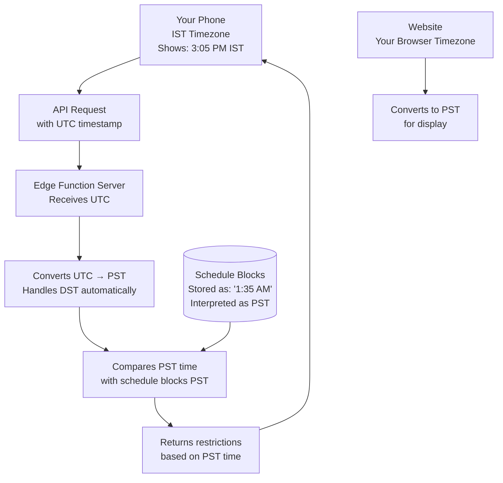

# Timezone Handling - How Everything Works Together

## Overview

**Everything operates in PST (Pacific Standard Time) / PDT (Pacific Daylight Time)**

Your phone's timezone doesn't matter - the system automatically converts everything to PST.

---

## Timezone Breakdown

### 1. **Your Phone (IST - Indian Standard Time)**
- **Your phone timezone:** IST (UTC+5:30)
- **What happens:** When your phone calls the edge functions, the **server** converts the time to PST
- **Result:** Your phone's timezone is irrelevant - the server handles conversion

### 2. **Website (Admin Panel)**
- **Operates in:** PST/PDT (converts browser time to PST)
- **What happens:** 
  - When you create schedule blocks, times are stored as text (e.g., "1:35 AM")
  - These times are interpreted as PST
  - The website converts your browser's local time to PST for display

### 3. **Schedule Blocks (Database)**
- **Stored as:** Text strings like "1:35 AM", "8:00 PM"
- **Interpreted as:** PST (Pacific Standard Time)
- **Location:** `schedule_blocks` table

### 4. **Edge Functions (Server)**
- **Operates in:** PST/PDT (converts UTC to PST)
- **Functions:**
  - `get-current-restrictions` - Converts current time to PST before checking schedule
  - `clock-in-via-qr` - Converts current time to PST before validating

---

## How It Works: Step by Step

### Example: Your Phone is in IST, Schedule is 1:35 AM PST

**Scenario:**
- Your phone shows: **3:05 PM IST** (2:35 PM + 12.5 hours = next day 1:35 AM PST)
- Schedule block: **Period 1: 1:35 AM - 1:37 AM PST**

**What Happens:**

1. **Your phone calls `get-current-restrictions`:**
   ```
   Phone (IST): 3:05 PM
   ↓
   Server receives request (with UTC timestamp)
   ↓
   Server converts UTC → PST
   ↓
   Server calculates: 1:35 AM PST
   ```

2. **Server checks schedule:**
   ```
   Current time (PST): 1:35 AM
   Schedule block: 1:35 AM - 1:37 AM PST
   ↓
   Match! Period 1 is active
   ```

3. **Server returns restrictions:**
   ```
   Returns: Period 1 class template apps
   ```

**Result:** Your phone gets the correct restrictions even though it's in IST!

---

## Timezone Conversion Flow



---

## Key Points

### ✅ What Works Automatically:

1. **Phone timezone doesn't matter**
   - Your phone can be in IST, EST, GMT, etc.
   - Server always converts to PST before checking schedule

2. **Website converts to PST**
   - When you view/create schedules, times are shown/entered as PST
   - Browser timezone is converted to PST for comparison

3. **Schedule blocks are always PST**
   - Times like "1:35 AM" are always interpreted as PST
   - No timezone stored - just text interpreted as PST

4. **DST handled automatically**
   - System detects daylight saving time
   - Automatically uses PDT (UTC-7) or PST (UTC-8)

### 📋 Timezone Offsets:

- **PST (Pacific Standard Time):** UTC-8 (winter)
- **PDT (Pacific Daylight Time):** UTC-7 (summer, March-November)
- **IST (Indian Standard Time):** UTC+5:30
- **Difference:** IST is 13.5 hours ahead of PST (or 12.5 hours ahead of PDT)

---

## Example Timeline

**Your Schedule (PST):**
- Period 1: 1:35 AM - 1:37 AM PST
- Period 2: 1:39 AM - 1:41 AM PST

**What Your Phone Sees (IST):**
- Period 1: 3:05 PM - 3:07 PM IST (1:35 AM PST = 3:05 PM IST)
- Period 2: 3:09 PM - 3:11 PM IST (1:39 AM PST = 3:09 PM IST)

**What Happens:**
1. Your phone shows 3:05 PM IST
2. Phone calls API with UTC timestamp
3. Server converts to PST: 1:35 AM PST
4. Server checks schedule: Period 1 is active
5. Server returns Period 1 restrictions
6. Phone applies restrictions

**Result:** Everything works correctly regardless of your phone's timezone!

---

## Code Locations

### Edge Functions (Convert to PST):
- `supabase/functions/get-current-restrictions/index.ts` (lines 59-74)
- `supabase/functions/clock-in-via-qr/index.ts` (lines 87-102)

### Website Components (Convert to PST):
- `src/components/admin/ActivePeriodIndicator.tsx` (lines 50-64)
- `src/components/CurrentClassStatus.tsx` (lines 56-64)

### Conversion Logic:
```typescript
// Get current time in PST
const now = new Date();
const isDST = isDaylightSavingTime(now);
const pstOffset = -8 * 60; // PST offset in minutes (UTC-8)
const actualOffset = isDST ? -7 * 60 : pstOffset; // PDT is UTC-7

// Convert UTC to PST/PDT
const utcTime = now.getTime() + (now.getTimezoneOffset() * 60000);
const pstTime = new Date(utcTime + (actualOffset * 60000));
const currentTime = pstTime.getHours() * 60 + pstTime.getMinutes();
```

---

## Summary

✅ **Everything operates in PST/PDT**
✅ **Your phone's timezone (IST) doesn't matter - server converts automatically**
✅ **Schedule blocks are stored as PST times**
✅ **Website converts browser time to PST**
✅ **Edge functions convert UTC to PST before checking schedule**
✅ **DST is handled automatically**

**Bottom line:** You can use your phone in IST, and everything will work correctly because the server always converts to PST before checking the schedule!

